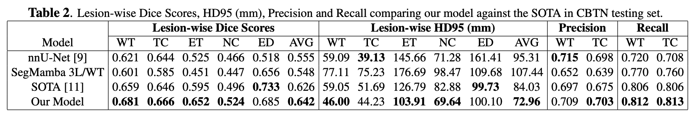
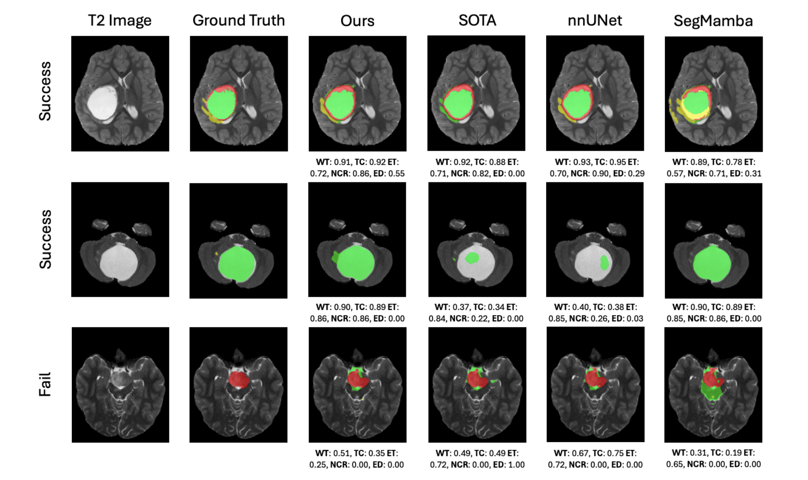

# Using a New Logic for Pediatric Brain Tumor Segmentations

In this study, we propose a a new logic for multiclass segmentation of pediatric brain tumors through the use of two independently trained models. One is trained to predict the whole tumor mask while the other delineates, enhancing tumor, cystic component, and edema. Through an overlay post processing we are able to to transform the outputs into a 4 label mask. Our results show improvements over the previous state-of-the-art (winner of [BraTS 2023 PED Challenge](https://www.synapse.org/Synapse:syn51156910/wiki/627802)) and a baseline [nnU-Net](https://github.com/MIC-DKFZ/nnUNet) trained on the same dataset.

This code reflects the model developed from this paper: [A New Logic For Pediatric Brain Tumor Segmentation](https://arxiv.org/abs/2411.01390)

Abstract: In this paper, we present a novel approach for segmenting pediatric brain tumors using a deep learning architecture, inspired by expert radiologists' segmentation strategies. Our model delineates four distinct tumor labels and is benchmarked on a held-out PED BraTS 2024 test set (i.e., pediatric brain tumor datasets introduced by BraTS). Furthermore, we evaluate our model's performance against the state-of-the-art (SOTA) model using a new external dataset of 30 patients from CBTN (Children's Brain Tumor Network), labeled in accordance with the PED BraTS 2024 guidelines and 2023 BraTS Adult Glioma dataset. We compare segmentation outcomes with the winning algorithm from the PED BraTS 2023 challenge as the SOTA model. Our proposed algorithm achieved an average Dice score of 0.642 and an HD95 of 73.0 mm on the CBTN test data, outperforming the SOTA model, which achieved a Dice score of 0.626 and an HD95 of 84.0 mm. Moreover, our model exhibits strong generalizability, attaining a 0.877 Dice score in whole tumor segmentation on the BraTS 2023 Adult Glioma dataset, surpassing existing SOTA. Our results indicate that the proposed model is a step towards providing more accurate segmentation for pediatric brain tumors, which is essential for evaluating therapy response and monitoring patient progress.

## Dataset

For model training we utilized the BraTS 2024 PED Challenge Dataset which can be found on [Synapse](https://www.synapse.org/Synapse:syn53708249/wiki/627759). After training, we tested on an out-of-distribution dataset from the Children's Brain Tumor Network (CBTN) and observed the following results.

 
 
 

## Set Up

Our model is built on the popular [nnU-Net](https://github.com/MIC-DKFZ/nnUNet) framework, this means environment preparation will require the same steps.

``` shell
pip install torch torchvision torchaudio
cd Pediatric-Brain-Tumor-Model/nnUNet
pip install -e .
```

Before running any preprocessing, training, or inference in the model ensure running this set of commands first:

``` shell
cd Pediatric-Brain-Tumor-Model
export nnUNet_raw="./data/nnUNet_raw"
export nnUNet_preprocessed="./data/nnUNet_preprocessed"
export nnUNet_results="./data/nnUNet_results"
```

## Preprocessing

All datasets must adhere to the naming scheme used by nnU-Net which means renaming image files to end in _0000 (FL), _0001 (T1), _0002 (T1C), and _0003 (T2). Whole tumor masks can be placed in `Pediatric-Brain-Tumor-Model/data/nnUNet_raw/Dataset100_WTTraining` and the 3 label masks can be placed into `Pediatric-Brain-Tumor-Model/data/nnUNet_raw/Dataset101_3LTraining`. Adjust the respective `dataset.json` files to account for the number of training examples. Run preprocessing with `nnUNetv2_plan_and_preprocess -d DATASET --verify_dataset_integrity` where the dataset is either 100 or 101 depending on whole tumor or 3 label.

## Training

For training specify the fold, device ID of GPU, and dataset. Once all folds are trained find the best configuration.

``` shell
CUDA_VISIBLE_DEVICES=0 nnUNetv2_train DATASET 3d_fullres FOLD --npz
CUDA_VISIBLE_DEVICES=0 nnUNetv2_find_best_configuration DATASET -c 3d_fullres
CUDA_VISIBLE_DEVICES=0 nnUNetv2_predict -i INPUT -o OUTPUT -d DATASET -c 3d_fullres
```

## Using Pretrained Model

Before running inference, preprocess the images using the CaPTK BraTS preprocessing pipeline. Next, skull strip the images. These steps can be accomplished through this repository: https://github.com/d3b-center/peds-brain-seg-pipeline-public.

The weights of the pretrained model can be found at this [link](https://drive.google.com/drive/folders/1dNwbkVnyTGoGZfr4tD10Mibv5jCopp2d?usp=sharing). After downloading, the files need to be extracted from the pretrained model zip (see below).


Run this in the terminal before extracting the pretrained model and running inference.
``` shell
export nnUNet_raw="./data/nnUNet_raw"
export nnUNet_preprocessed="./data/nnUNet_preprocessed"
export nnUNet_results="./data/nnUNet_results"
```

Download the the zip files from the Google Drive and place them in `Pediatric-Brain-Tumor-Model`. Then use the command `nnUNetv2_install_pretrained_model_from_zip ./WT.zip` and `nnUNetv2_install_pretrained_model_from_zip ./3L.zip` which will extract the pretrained models.

For inference, use the commands below to predict the whole tumor mask, 3 label mask and then postprocess the masks. Input needs to be in the same standard nnU-Net formatting as the training set using _0000, _0001, _0002, and _0003.

``` shell
CUDA_VISIBLE_DEVICES=0 nnUNetv2_predict -d Dataset106_WTPED24 -i INPUT_FOLDER -o ./postProcessing/outputWT -f  0 1 2 3 4 -tr nnUNetTrainer -c 3d_fullres -p nnUNetPlans
CUDA_VISIBLE_DEVICES=0 nnUNetv2_predict -d Dataset107_3LabelPED24 -i INPUT_FOLDER -o ./postProcessing/output3L -f  0 1 2 3 4 -tr nnUNetTrainer -c 3d_fullres -p nnUNetPlans
python ./postProcessing/conversion.py
```

Outputs can be found in `Pediatric-Brain-Tumor-Model/postProcessing/relabeled`.


## Citation

```
@article{bengtsson2024new,
  title={A New Logic For Pediatric Brain Tumor Segmentation},
  author={Bengtsson, Max and Keles, Elif and Durak, Gorkem and Anwar, Syed and Velichko, Yuri S and Linguraru, Marius G and Waanders, Angela J and Bagci, Ulas},
  journal={arXiv preprint arXiv:2411.01390},
  year={2024}
}
```


